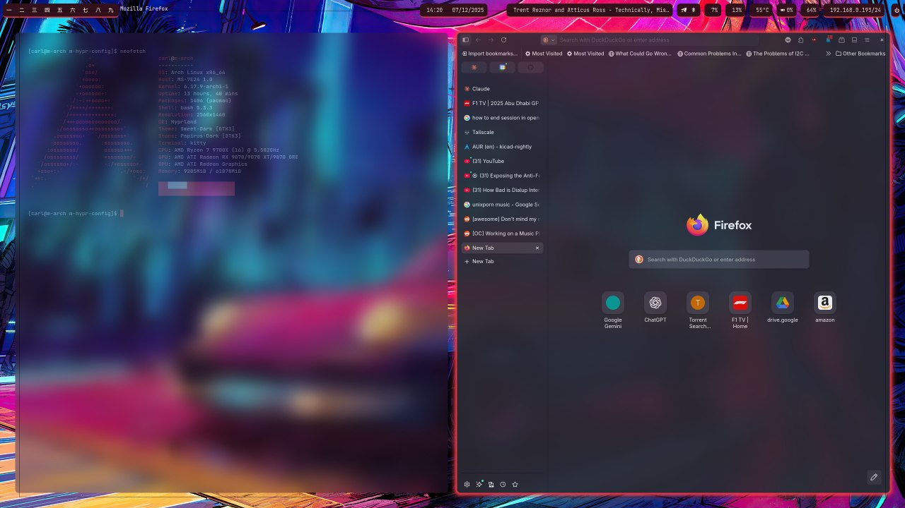
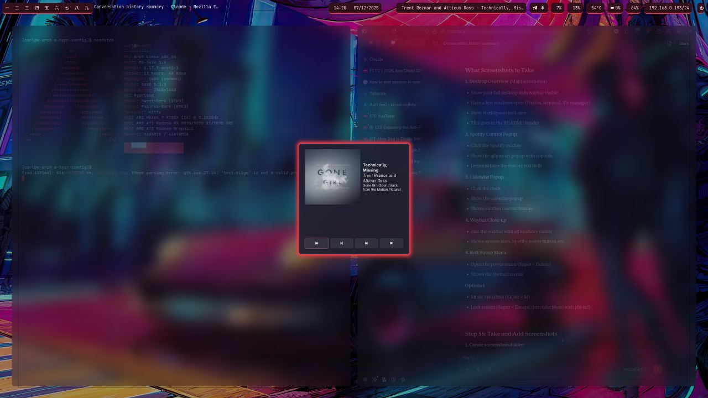
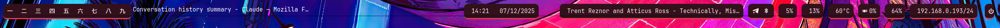
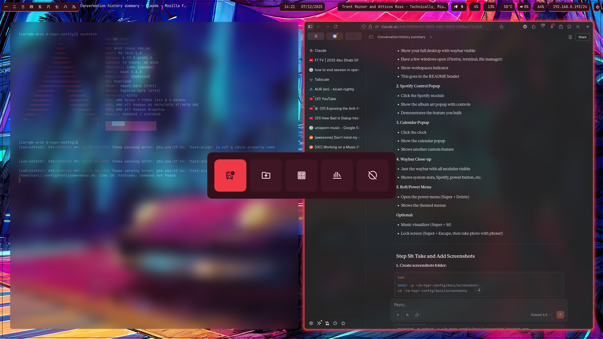

# M-Hypr-Config

My personal Hyprland setup on Arch Linux with a cyberpunk red/pink theme.

## Screenshots

### Desktop Overview


### Spotify Control


### Waybar


### Power Menu



## Features

- 🎨 Cyberpunk red/pink color scheme
- 🎵 Spotify control with album art popup
- 📅 Calendar popup on clock click
- 🖥️ System monitoring (CPU, RAM, GPU, Temperature)
- 🌐 Remote access via SSH and Tailscale
- 🎮 OpenRGB lighting control
- ⌨️ Optimized keybindings with arrow keys

## Quick Install
```bash
git clone https://github.com/yourusername/m-hypr-config.git
cd m-hypr-config
chmod +x install.sh
./install.sh
```

## Components

- **WM:** Hyprland
- **Bar:** Waybar
- **Terminal:** Kitty
- **Launcher:** Rofi
- **File Manager:** Dolphin
- **Music:** Spotify + playerctl
- **Theme:** hypr-dots (customized)

## Keybindings

### Applications
- `Super + Return` - Terminal
- `Super + D` - App launcher
- `Super + B` - Firefox
- `Super + E` - File manager
- `Super + M` - Music visualizer

### Window Management
- `Super + Arrow Keys` - Focus windows
- `Super + Shift + Arrow Keys` - Move windows
- `Super + Ctrl + Arrow Keys` - Resize windows
- `Super + F` - Fullscreen
- `Super + V` - Toggle floating
- `Alt + Tab` - Cycle windows

### System
- `Super + Escape` - Lock screen
- `Super + Delete` - Power menu
- `Super + W` - Toggle waybar
- `Print` - Screenshot region
- `Shift + Print` - Screenshot fullscreen

## System Info

- **OS:** Arch Linux
- **Resolution:** 2160x1440@165Hz
- **GPU:** AMD
- **Layouts:** US/BR (Ctrl+Space to toggle)

## Remote Access

- SSH on port 2222
- Tailscale for remote access from anywhere
- Remote lock/shutdown via phone

## Credits

Based on [HyprDots](https://github.com/prasanthrangan/hyprdots) by [Prasanth Rangan](https://github.com/prasanthrangan) with custom modifications and enhancements.

## License

This configuration inherits the GPL-3.0 license from HyprDots. See [LICENSE](LICENSE) for details.
