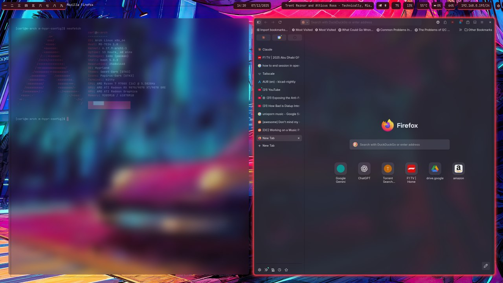
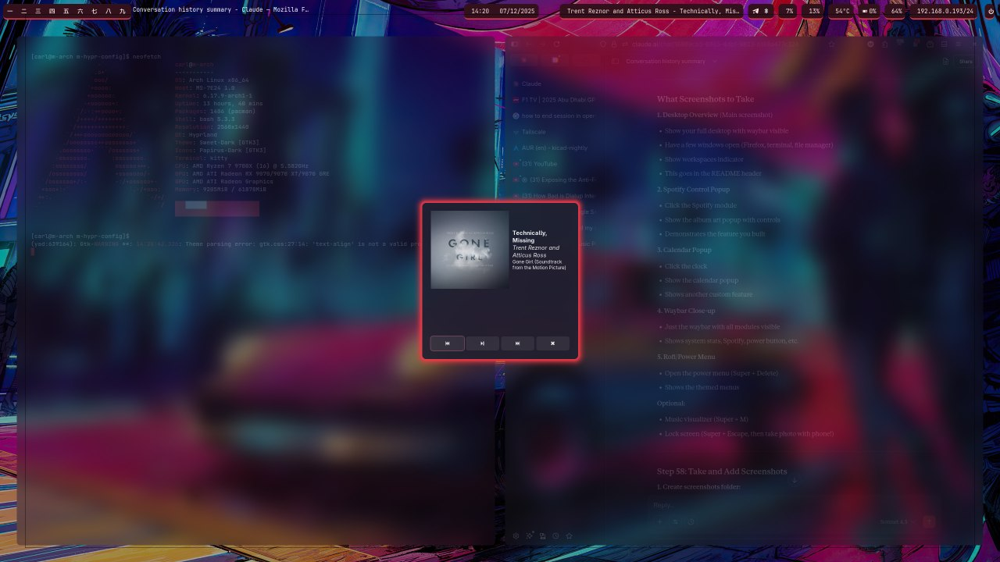
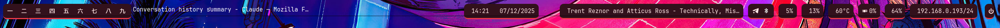
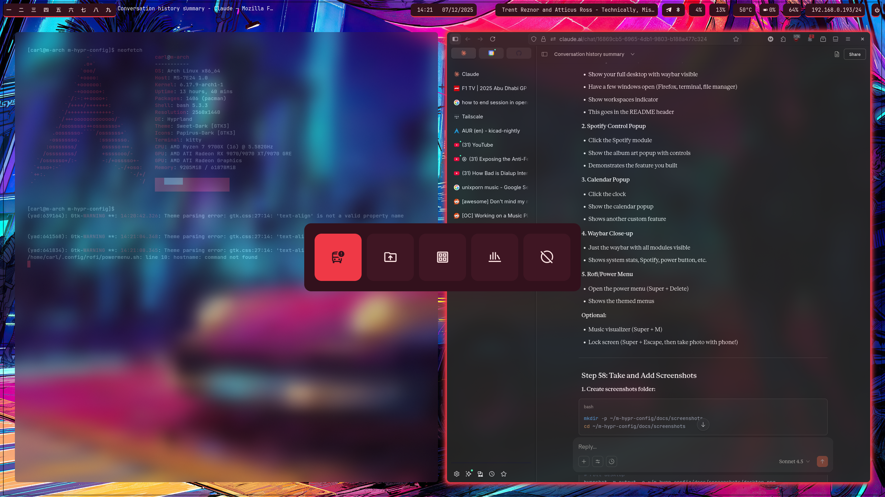

# m-hypr-config


My personal Hyprland setup on Arch Linux — cyberpunk red/pink theme, one-command install on a fresh box. Built on top of [HyprDots](https://github.com/prasanthrangan/hyprdots), customized for my hardware and aesthetic.

This is the config I actually run every day. Sharing it in case it's useful, not because I'm trying to support a distro.

## Screenshots

### Desktop Overview


### Spotify Control


### Waybar


### Power Menu


---

## Why I Built This

Two reasons, one petty and one real.

The petty one: I'd been on mainstream distros for years and always wanted to graduate to a fully custom Arch Linux setup — partly so I could finally say *"I use Arch btw"* and mean it, partly because I wanted a daily driver I'd actually built rather than one that came pre-assembled.

The real one: HyprDots is a great starting point, but I wanted my own aesthetic. The cyberpunk red/pink palette isn't a theme anyone else really ships — most ricing leans Catppuccin pastels or Tokyo Night blues. I wanted something deliberately louder, tied to the same visual language as the rest of my projects (the LED hardware, the OpenRGB setup, the room lighting). Forking HyprDots and reskinning it from the inside was the fastest path.

The end goal was a reproducible, one-command setup. If I ever blow up my install or rebuild on new hardware, I want to be back at this desktop in under an hour without manual fiddling.

---

## Initial Requirements

| # | Requirement | Outcome |
|---|---|---|
| 1 | Fully custom Arch Linux config (no mainstream distro defaults) | ✅ |
| 2 | Hyprland on Wayland (no X11) | ✅ |
| 3 | Cyberpunk red/pink theme across Waybar, Rofi, Kitty, notifications | ✅ |
| 4 | One-command install on a fresh Arch box | ✅ |
| 5 | Spotify control with album art popup | ✅ |
| 6 | Calendar popup on clock click | ✅ |
| 7 | System monitoring (CPU/RAM/GPU/temp) in the bar | ✅ |
| 8 | OpenRGB integration to match desktop theme | ✅ |
| 9 | Optimized keybindings (arrow-key window focus, no Vim bindings) | ✅ |
| 10 | Dual-monitor support | ✅ |
| 11 | Reproducible package list (pacman + AUR) | ✅ |

Remote access (SSH, Tailscale, remote lock from phone) was deliberately moved out of this config and into the [homelab](https://github.com/HighCarlSagan/Carls_Homelab) repo — it isn't a desktop concern, it's an infrastructure concern.

---

## Features

- 🎨 Cyberpunk red/pink color scheme across Waybar, Rofi, Kitty, notifications
- 🎵 Spotify control with album art popup in Waybar
- 📅 Calendar popup on clock click
- 🖥️ System monitoring — CPU, RAM, GPU, temperature
- 🎮 OpenRGB lighting control synced to the desktop theme
- ⌨️ Arrow-key window focus and movement (no HJKL)
- 🪟 Dual-monitor layout (2560×1440 primary + 1080p secondary)
- 📦 One-command install with pacman + AUR package lists

---

## System

| Component | Value |
|---|---|
| OS | Arch Linux |
| Kernel | linux (mainline) |
| WM | Hyprland |
| Bar | Waybar |
| Terminal | Kitty |
| Launcher | Rofi |
| File Manager | Dolphin |
| Music | Spotify + playerctl |
| Theme base | hypr-dots (heavily customized) |
| CPU | AMD Ryzen 7 9700X |
| GPU | AMD Radeon RX 9070 XT |
| Monitors | 2560×1440 primary (DP-3, Samsung) + 1080p secondary (HDMI-A-1, BenQ) |
| Refresh | 165 Hz primary |
| Keyboard layouts | US / BR (Ctrl+Space to toggle) |

Full hardware details: [`SYSTEM_SPECS.md`](SYSTEM_SPECS.md)

---

## Quick Install

```bash
git clone https://github.com/HighCarlSagan/m-hypr-config.git
cd m-hypr-config
chmod +x install.sh
./install.sh
```

The install script will:

1. Install pacman packages from `packages-explicit.txt`
2. Install AUR packages from `packages-aur.txt` (via `yay`)
3. Symlink `hyprland.conf` and the `configs/` tree into `~/.config/`
4. Copy `scripts/` to `~/.local/bin/` and mark executable
5. Set the default wallpaper from `wallpapers/`

> ⚠️ This is my personal config. It assumes Hyprland, an AMD GPU, and a few opinionated choices (Rofi over wofi, Kitty over Alacritty, Dolphin over Thunar). Fork it and adapt — don't expect it to work unchanged on every Arch box.

---

## Repository Structure

```
m-hypr-config/
├── configs/                 # Per-app config files (Waybar, Rofi, Kitty, etc.)
├── docs/
│   └── screenshots/         # Desktop screenshots
├── scripts/                 # Helper scripts (Spotify popup, power menu, etc.)
├── wallpapers/              # Curated wallpaper set
├── hyprland.conf            # Main Hyprland config
├── install.sh               # One-command install
├── backup.sh                # Backs up scripts + configs to this repo
├── packages-explicit.txt    # Explicitly-installed pacman packages
├── packages-aur.txt         # AUR packages (yay)
├── packages-all.txt         # Full package list (reference)
├── SYSTEM_SPECS.md          # Detailed hardware spec
└── LICENSE                  # GPL-3.0 (inherited from HyprDots)
```

---

## Keybindings

### Applications
| Key | Action |
|---|---|
| `Super + Return` | Terminal (Kitty) |
| `Super + D` | App launcher (Rofi) |
| `Super + B` | Firefox |
| `Super + E` | File manager (Dolphin) |
| `Super + M` | Music visualizer |

### Window Management
| Key | Action |
|---|---|
| `Super + Arrow Keys` | Focus window in direction |
| `Super + Shift + Arrow Keys` | Move window in direction |
| `Super + Ctrl + Arrow Keys` | Resize window |
| `Super + F` | Fullscreen |
| `Super + V` | Toggle floating |
| `Alt + Tab` | Cycle windows |

### System
| Key | Action |
|---|---|
| `Super + Escape` | Lock screen |
| `Super + Delete` | Power menu |
| `Super + W` | Toggle Waybar |
| `Print` | Screenshot region |
| `Shift + Print` | Screenshot fullscreen |
| `Ctrl + Space` | Toggle keyboard layout (US ↔ BR) |

---

## Scripts

All custom scripts live in `scripts/` and are copied to `~/.local/bin/` by the install script.

| Script | Purpose |
|---|---|
| `control` | Top-level dispatcher for various system actions |
| `spotify-popup` | Renders album art and current track when Spotify is playing |
| `power-menu` | Rofi-based power/reboot/lock/logout menu |
| `calendar-popup` | Clock-click calendar overlay |
| `openrgb-sync` | Syncs OpenRGB lighting profiles to the desktop theme |
| `wallpaper-randomize` | Picks a random wallpaper from `wallpapers/` |

> Most of these currently live in `~/.config/` on my system and are in the process of being consolidated into this repo. See [Roadmap](#roadmap).

---

## Backup

`backup.sh` snapshots my current `~/.config/` tree and `~/.local/bin/` scripts back into this repo so it stays in sync with my live system. Run it after making changes to the live config:

```bash
./backup.sh
git add -A
git commit -m "Sync live config"
git push
```

---

## Wallpapers

A small curated set lives in `wallpapers/`. More will be added over time — the theme leans toward dark cyberpunk visuals with pink/red accents to match the rest of the desktop.

A sister project to automatically rotate NASA's Astronomy Picture of the Day as wallpaper is planned but not yet started.

---

## Roadmap

- Move all custom scripts from `~/.config/` into `scripts/` and update `install.sh` accordingly
- Add more wallpapers to the curated set
- **APOD wallpaper sister project** — auto-fetch NASA's Astronomy Picture of the Day and set as wallpaper. Repo TBD.
- Rebuild the install script as the config has drifted significantly since the last full reinstall
- Consider splitting "theme" from "layout" so the cyberpunk skin can be swapped without touching keybindings

---

## Related Projects

- [Carls_Homelab](https://github.com/HighCarlSagan/Carls_Homelab) — the infrastructure side of the same desk: SSH, Tailscale, remote lock, file sync, all the things that aren't a window manager's job

---

## Credits

Based on [HyprDots](https://github.com/prasanthrangan/hyprdots) by [Prasanth Rangan](https://github.com/prasanthrangan), with custom modifications and a complete reskin.

---

## License

GPL-3.0, inherited from HyprDots. See [LICENSE](LICENSE).

---

## Author

**Mak (Mayank Shrivastava)**
[github.com/HighCarlSagan](https://github.com/HighCarlSagan)

I use Arch btw.
